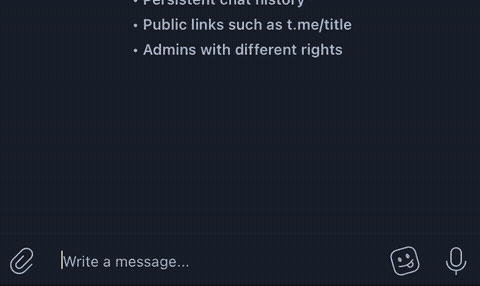

# telegram-video-download-bot

Telegram Bot for downloading videos sent to group chats. The original message is also deleted, so chat history doesn't become cluttered.  

See it in action!


## Setting up

1. Have this bot running somewhere. See [Bots: An introduction for developers](https://core.telegram.org/bots) for more instructions.
2. Set group privacy off (bot reads only messages ending " dl").
3. Invite bot to group you want.
4. Post a message that contains link and ends with " dl", e.g, `https://www.youtube.com/watch?v=9S8eNZ4fw5I dl`.

## Running

Following environment variables are always required:

| variable | description |
|:--|:--|
| TELEGRAM_TOKEN | Your bot token. See [Bots: An introduction for developers](https://core.telegram.org/bots) |
| TARGET_DIR | Directory where videos are temporarily stored. |

### With Leiningen

This expects following executables to available at current PATH `curl` and `yt-dlp`.  

Make sure you have [Leiningen](https://leiningen.org/) installed. Then simply `lein run`.  

### With Docker

```
docker build -t telegram-video-bot .
docker run -e TELEGRAM_TOKEN="__" -e TARGET_DIR=/tmp telegram-video-bot
```

